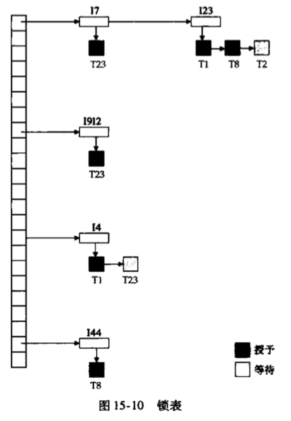

# <center>Note of Database Review

## Key definition

- Primary key: only one attribute
- Super key: a set of attributes that defines a unique instance
- Candidate key: minimum true subset of a super key
- Foreign key: referencing relation outside of the table

## Relation algebra

- __Sigma__: select --> select a tuple

- __Pi__: shadow --> select an attribute

- __IXI__: join two table by their commom attributes

- __X__: Decal multiplication

- __U__: union of two tuple sets, and eliminates the common tuples

- __rho__: rename, rho x(y) --> to rename y as x

- __minus__: **a - b** means something in **a** but not in **b**.  

- __<--__: assign a value to something

- $G$: group function, $G$~sum(attributeName)~ $(tableName)$

  ​	sum, average, count, count_distinct

  ​	 ~G1,G2,G3~ $G$ ~f1(a1),f2(a2)~ $(tableName)$, g~i~ means attribute

- __^__: and

- __v__: or

## SQL query

- Trigger format:

  - create trigger __triggerName__ after/before __insert/delete__/**update** (of **attributeName**) on __tableName__

    referencing new row as __nrow__

    refrencing old row as orow

    for each row

    when (**nrow**.__attributeName__ in/not in (

    ​	select __attributeName__

    ​	from __tableName__)

    and orow.__attributeName__ in/not in (

    ​	select ......))

    begin (***atomic***)

    ​	rollback

    end;

  - alter/drop trigger __triggerName__ disable

## E-R diagram

- **Arrows**
  - A <———— B ————> C, means b is a relation between A and C, and it's a one-to-one relation;
  - A <———— B ———— C, means multi Cs are related to only one A;
  - A ———— B ———— C, means multi As and multi Cs
- **Weak entity set**: without a primary key; (strong entity set: has a primary key.)
  - The discriminator of a weak entity set will be underlined with a dotted line: _ _ _ _. (dicriminator is a set of attributes that defines a unique tuple, aka partial code)
  - The relation set between a weak entity set and a strong one will be a double diamond.
  - The double line means a multi-value attribute (an attribute that can have more than one value)
- **Relation set**
  - Multi-multi, 2 sets related: union of primary keys of the two sets
  - One-one, 2 sets: any primary of the two sets
  - Multi-one, 2 sets: the primary key of the 'multi' one.
  - Multi-multi, n sets: union of the primary keys of all the sets
  - Multi-one, n sets: the 'one' is unique in order to have only one meaning, so —— union of the primary keys of multi ones

## Functional Dependent

- A1 -> A2 means if t1[a1] == t1[a1], then t1[a2] == t2[a2].
  - t1 does not have to be a super key or primary key
  - A trival FD means a2 <u>C</u> a1, while an untrival one does not.

### Normal Forms

- 1NF: **all the domains of attributes are atomic**
- BCNF: **all the FDs in F+, they are either trival FDs, or a1 is a super key of relation R**
  - How to decompose a non-BCNF schema: 
    - Example: a -> b, but a is not a super key or primary key, and b is not included by a (not trival);
      - __a U b -> (R - (b - a))__
  - Note: only the duplications of FD can be eliminated, not all
- 3NF: weaker than BCNF, by including another possibility saying **the attibutes in (b - a) is included in a candidate key of R.**

### F+

- F is a set of FDs, and F+ is the complete closure of FDs.

- Armstrong's axiom: used to calculate the F+.

  - **Reflexive rule: if a is an attribute set and b <u>C</u> a, then a -> b**
  - **Augmentation rule: if a -> b and y is an attribute set, then ya -> yb**
  - **Transitivity rule: if a -> b and b -> y, then a -> y**

- Addition to Armstrong's axiom: can be proved using the basic 3 axioms.

  - **Union rule: if a -> b and a -> y, then a -> by**
  - **Decomposition: if a -> by, then a -> b and a -> y**
  - **Pseudotransitivity rule: if a -> b and yb -> s, then ay -> s**

- Algorithm of calculating the F+:

  ```python
  F+ = F
  
  	repeat:
  
  		for FD in F+:
  
  			use reflexive rule and augmentation rule
  
  			add the results in F+
  
  		for FD1 and FD2 in F+:
  
  			if FD1 and FD2 can be related with transitivity rule:
  
  				add the results in F+
  
  	until F+ does not change.
  ```

- Algorithm to calculate the closure of attribute set **a** (the closure includes all the attributes dependent of a):

  ```python
  result = a
      repeat:
          for FD(b -> y) in F do:
              	if b C result:
                  	result = result U y
  	until result does not change.
  ```

### Extraneous

- Extraneous: if deleting an attribute does not change the closure F+, then the attibute is extraneous.
  - **If A belongs to a and F logically imply (F - {a -> b}) U {(a - A) -> b}, then A is extraneous in a.**
  - **If A belongs to a and (F - {a -> b}) U {a -> (b - A)} logically imply F, then A is extraneous in b.**
  - Eg1: if AB -> C and A -> C, then B is extraneous in AB -> C.
  - Eg2: if AB -> CD and A -> C, then C is extraneous in AB -> CD.
  - Note: the conditions will **always be true** if the logical implimention is reversed.

### Canonical covers

- Canonical cover: a dependent set Fc where F logically imply Fc and Fc logically imply F.

  - **All the FD in Fc does not include an extraneous attribute.**
  - **All the FD in Fc, the left part is unique. (that is to say, a -> b and a -> c should be written as a -> bc)**
  - Note: canonical covers are not necessarily unique.

- Algorithm to calculate an Fc:

  ```python
  Fc = F
  	repeat:
          use Union rule to replace all the FD with same left sets
          find an FD(a -> b) in Fc where a or b includes an extraneous attribute
          	delete the attribute from a -> b
       until Fc does not change.
  ```

## Decompositions

- Decomposition: a |X| b == R.

- **Lossless decomposition**

  - Either a ^ b -> a or a ^ b -> b belongs to F+.
  - Also can be mentioned as: **a ^ b is a super key on a or b**.

- **Dependency-preserving decomposition**

  - ......

- **BCNF decomposition**

  ```python
  result = [R]
  	done = False
      
      # calculate F+:
      ......
      
      while not done:
  		for Ri in result:
  			if Ri is not BCNF:
                  find such an a -> b that
                  1. hold on Ri 
                  2. is not trival
                  3. a -> Ri does not belong to F+
                  4. a and b have no common attributes
                  
                  then result = (result - Ri) U (Ri - b) U (a, b)
      else done = True.
  ```

  - This algorithm is **lossless decomposition** because when we replace Ri with (Ri - b) and (a, b), a -> b, and (Ri - b) ^ (a, b) = a.
  - If **a ^ b <> empty set**, the attributes of a ^ b will not be in (Ri - b), and a -> b will **NOT** hold on R.

- **3NF decomposition**

  ```python
  Fc = cononical cover of F
  i = -1
  
  for FD(a -> b) in Fc:
      i += 1
      Ri = ab
      
  for Rj in R(0:i):
      if Rj does not include the candidate of R:
      	i += 1
          Ri = any candidate key of R.
  
  # optional: delete duplicate relations, until no dup exists.
  if Rj is included in Rk:
      i -= 1
      delete Rj.
  ```

- **4NF**

  - ......

## variable length record

- Implementation

  - Problems:

    - How to describe a record so that a single attribute can easily fetch it.
    - How to store the record in a block so that the record can be easily fetched.

  - **Null bitmap**

    - Overall structure:

      **Fixed attributes' values  +  (offset, lengths)s  +  Null bitmap  +  variable attributes' values**

    - Store the fixed-size attributes first, and then the variable ones.
    - At the head of varaible part in each record, the attribute's **(offset, length)** information are stored, followed by the value of it.
    - A string of 0 and 1 will tell which attributes are NULL (1 if NULL) after the (offset length) ino.

  - **Slotted-page structure**

    

    - Each block has a blockhead that stores:
      1. the number of entries;
      2. a pointer to the end of free space in the block;
      3. an array consisting of position and size of each record.
    - Note: 
      1. the free space is a continuous space, from the end of the array and the first record.
      2. when inserting a record, the new record will be placed at the end of the free space.
      3. when deleting a record, the size of this record in the array will be set -1, and the records before it will be moved and the pointer to the end of free space will be moved too.

  - Big objects are not directly stored in the database, but often stored by their pointers using **B+ tree**.

## File storage

- **Heap file organization**: records are placed in random order.
- **Sequential file organization**: records are placed in the order of their searching-code.
- **Hasing file organization**: calculate a hashing function on one attribute of the records and store the records  according to the hashing results.
- **Multiple clustering file organization**: several tables are stored in the same file.

### Sequential file organization

- Pointer linked list
- Insert:
  1. locate the place to insert a record.
  2. if there is enough space to insert, do it; else the record will be inserted into a overflow block.
  3. Anyway, the pointer needs to be adjusted so that the record can be searched with searching-code.
  4. In some cases, the file needs reorganization.
- Delete: using pointer linked list.

## Buffer

- **Buffer replacement strategy**: when there's little space left, the **LRU** (least recently used) block will be written to disk files and removed.
- **Pinned block**: when writting on a block, theblock is pinned and should not be written to files.
- **Forced output of block**: when the system break down, the block should be immediately written back to files.
- ......

# B+Tree

- Time complexity: **O($log$ ~ceil(n/2)~ (N))**, and n is the maximum number of pointers in a node, and N is the number of records.

- Note: the pointer of index node will point at the leaf whose value equals to the value **ahead of** the pointer.

- Search

  ```python
  def find(value v):
  	c = root
      while c != leafNode:
          let i be the minimum value such that v <= c.k[i]
          if i > MAXN: # no such value
          	p[m] = the last not null pointer of c
              c = p[m]
          elif v == c.k[i]:
          	c = c.p[i+1]
          else: # smaller than k[i]
              c = c.p[i]
      
      # c is a leaf node
      find c.k[i] = v
      if i exist:
  	    return c, i
  ```

- Insert

  - Follow the steps of search.
  - If the node can be placed in the node, insert it;
  - Else split the node; if the parent node is also full, split it too, and the the inserted new node will go to upper levels.
  - Note that every time a node split, the parent needs to add one pointer to point at it.

- Delete

  - Follow the steps of search.

  - Delete the node:

    - If the node is root:

      - If the root only has one child or its root can be merged, delete the node and let the child be root.
      - Change the root value.

    - If the leaf node has two values (deleting one value will make a rather empty node), check the leaf node before it.

      ​	a. If the sibling (the node before the node to delete) can be merged with it, merge them.

      ​	b. Else lend one value from the sibling.

    - Change the parent node: **delete** one value if a merge happened, or **alter** one value if a lend happened.

- Calculation

  **maxn = the maximum of pointers in an index node.**

  Eg: maxn = 4, 10000 index items (which means 10000 **records**).

  - Node ——> Height:
    - There are 2-3 keys in a leaf node, and 2-4 children in an index node.
    - minimum height = log 4 (10000/3) + 1.
    - maximum height = log 2 (10000/2) + 1.
  - Height ——> Node:
    - leafNodes = ceil(10000/3).
    - Total nodes = ceil(10000/3) + ceil(ceil(1000/3)/4) + ceil(ceil(ceil(1000/3)/4)/4) + ... + 1.

- Bulk load

  - When inserting a lot of tuples, sort them first and insert in order will be more efficient than inserting randomly.
  - When creating an index from current tuples, we can directly build a B+-tree, that is called 'Bottom-up build', which is faster than inserting ('up-bottom method').

## Hashing

- Close addressing: use a <u>overflow bucket</u> (implemented by a **linked list**)
- Open addressing: use **linear probing** or other methods if a overflow happened; because delete will be hard for it, a database will **NOT** use this method.

## Query execution

- Cost estimation

  

  ## Cost of Link

  - n = number of records, b = number of blocks.
  - **Nested-loop join**
    - Worst case: 
      - Search times = n1 + b1.
      - Transport times = n1 * b2 + b1.
    - Best case: 
      - Search times = 2.
      - Transport times = b1 + b2.
    - Total = Ts + Tt.
  - **Block nested-loop join**
    - Worst case:
      - Search times = 2b1.
      - Transport times = b1 * b2 + b1.
    - Best case:
      - Search times = 2.
      - Transport times = b1 + b2.
    - Total = Ts + Tt.

  

  ### Very important !!!

  - ***Improved block nested-loop join***

    

  

  - **Indexed nested-loop join**
    - Total = b1 * (Ts + Tt) + n1 * c.
  - **Merge join**
    - Search time = ceil(b1/bb) + ceil(b2/bb).
    - Transport time = b1 + b2.
    - Merge sort
      - Search = 2 * ceil(br/M) + ceil(br/bb) * (2 * ceil(log floor(M/bs)-1 (br/M)) - 1).
      - Transport = br * (2 * ceil(log M-1 (br/M)) + 1).
      - Merge times = ceil(log M-1 (br/M))
  - **Hashing join**
    - NOT recursive partitioning:
      - Search times = 2 * ceil(b1/b2) + ceil(b2/bb) + 2 * nh. (Bb: blocks offered to buffer)
      - Transport times = 3 * (b1 + b2) + 4 * nh. (nh: partitioning number)
    - recursive partitioning:
      - Search times = 2 * (ceil(b1/bb) + ceil(b2/bb))  * ceil(log M-1 (b2) - 1). 
      - Transport times = 2 * (b1 + b2) * ceil(log M-1(b2) - 1) + b1 + b2. (M: number of buffers for each partition)
    - Big main storage:
      - nh = 0.
      - Search times = 2.
      - Transport times = b1 + b2.

  ## Equivalence rules

  - Cascade of sig: sig cond1^cond2 (E) = sig cond1(sig cond2 (E))
  - Communitive: sig cond1 (sig cond2 (E)) = sig cond2 (sig cond1 (E))
  - Cascade of pi: pi l1 (pi l2 (pi l3 (pi l4 (...(pi ln (E))))))) = pi l1 (E), where l1 <u>C</u> l2 <u>C</u> l3 <u>C</u> ... <u>C</u> ln.
  - ......

## ACID

- **Atomicity**: done or not done.
- **Consistency**: constrains that make sure for the data is consistent.
- **Isolation**: each transaction is done free of other transactions' disturbance.
- **Durability**: the results will stay still in the DB when the transaction is done.
- Works related to ACID:
  - A - recovery system (commit.)
  - C - constrains (like primary key, unique, etc.)
  - I - concurrency-control system (locks.)
  - D - recovery system (write the changes to disk files.)

## Serializable

- Precedence graphs
  - Rules: (assume operation t1.a is ahead of operation t2.b)
    - If a = r and b = w, draw t1 -> t2.
    - If a = w and b = r, draw t1 -> t2.
    - If a = w and b = w, draw t1 -> t2
    - In a word, if a or b is write, draw a line between the former(a) to the latter(b).
  - Note: if there is no **loops** in the graph, then the schedule is serializable and vice versa.
- If a schedule is serializable, give the series according to the graph, in the format of <T1, T2, T3>.

## Schedule and Isolation

- Status of a schedule

  - **Active**: initial status.

  - **Partially committed**: after the last query is being executed.

  - **Failed**: fail to execute.

  - **Aborted**: failed and rolled back.

  - **Committed**: finished.

  - **Terminated**: committed or aborted.

    

- **Recoverable**: A recoverable schedule is one where, for each pair of Transaction Ti and Tj such that Tj  reads data item previously written by Ti   the commit operation of Ti  appears before the **commit** operation Tj.

- **Cascadeless**: A cascadeless schedule is one where for each pair of transaction Ti  and Tj  such that Tj  reads data item, previously written by Ti   the commit operation of Ti  appears before the **read** operation of Tj. (*if not, once Ti fails, all the transactions dependent on Ti will have to roll back, and that is called cascade rollback.*)

- **Every Cascadeless schedule is also recoverable schedule.**

- **Class of Isolation** (from highest to lowest)

  - Serializable
  - Repeatable read
  - Read commit
  - Read uncommitted

## Lock

- Types of lock

  - **S** —— shared lock: read but not write
  - **X** —— exclusive lock: no read or write
  - S and S are compatible, but S and X / X and X are not.
  - A transaction can request for a lock, but before the system give it the lock, the transaction has to wait for the previous owner of lock to unlock it.
  - If a transaction is waiting for so long that it can never be executed, it is called **starve**.

- **2PL** ———— two-phase locking protocol

  - ***growing*** phase: a transaction can get a lock but not unlocking one.

  - ***shrinking*** phase: a transaction can unlock a lock but not getting one.

  - lock point: after getting the last lock.

  - Lock conversion: an S-lock can be upgraded to X during growing phase, and an X-lock can be downgraded to S during shrinking phase.

  - <u>Strict mode</u>: X-locks have to be unlocked ***after*** the transaction is committed.

  - <u>Rigorous mode</u>: Each lock has to be unlocked ***after*** the transaction is committed.

  - <u>An easier mode</u>:

    - When Ti tries to read, system will add a lock-S before executing the read operation.

    - When Ti tries to write, system will check if the item is under a lock-S, and will either:

      - Upgrade the lock-S;
      - Add a lock-X;

      and then do the write operation.

    - When Ti is terminated (either committed or failed), the locks owned by it will be unlocked.

  - Lock manager:

    - Each data item has a linked list.
    - Black rectangle means the lock has been granted, and white ones means waiting for granting.
    - How to maintain:
      - 
    - Eg:
      - data item: I7, I23, I912, I4, I44.

    

- ......

## XML —— some examples

- **Head of XML file**: <xs: schema xmlns:xs = "http://www.fuckDatabase.com">

- **Sequence of attributes**: <xs: sequence>...</xs: sequence>

- **Ways to define a relation set**:

  - <xs: element name = "xxxx" type = "xs: string" // "xs: decimal"//"xxxx_type"(**DIY type**) />

    *//......definition of other things......*

    ​	<xs: complexType name = "xxxx_type">

    *//......definition of xxxx_type......*

    ​	</ xs: complexType>

    </ xs: element>

  - <xs: emelemt name = "xxxx">

    ​	<xs: complexType>

    //*……definition of xxxx_type......*

    ​	</ xs: complexType>

  - **MAX and MIN occurance**: <xs: element …… minOccurs = "0" maxOccurs = "unbounded">

- **End of XML file**: </ xs: schema>

## DTD

- ......