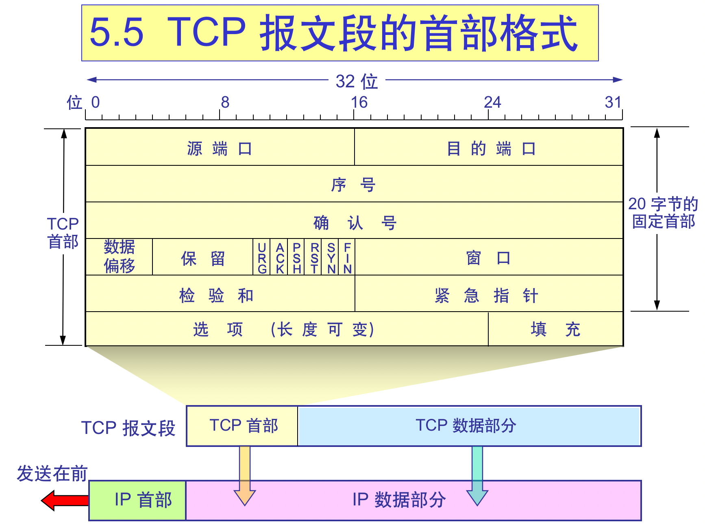
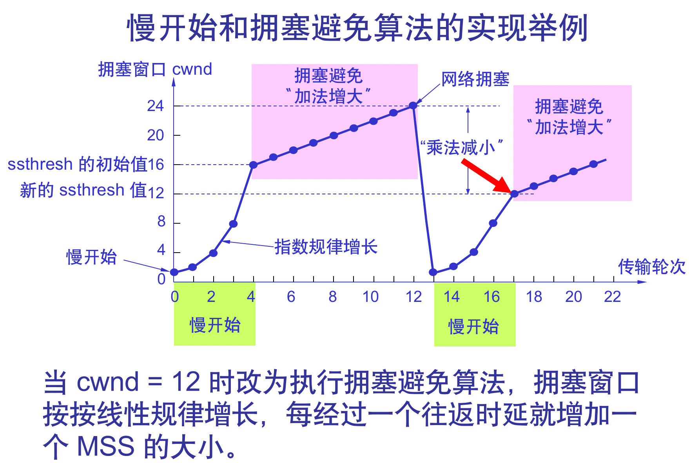
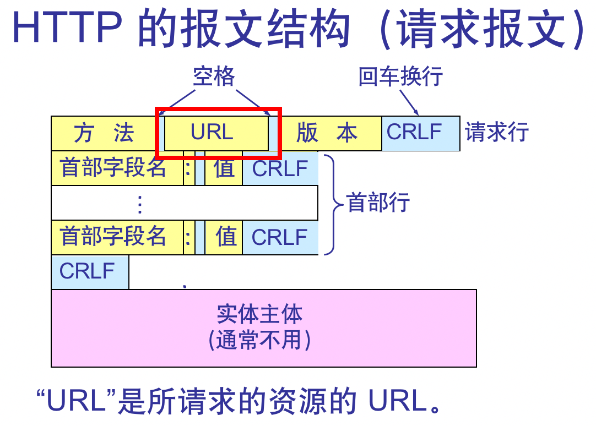
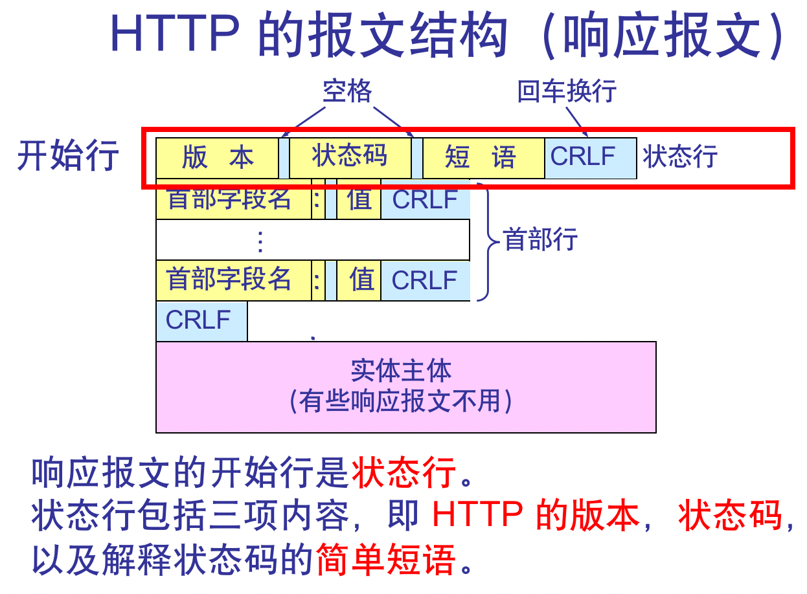

# 计网考点&&散知识点

> **计网不能只看关键考点，还要看一些广而浅的知识点。所以只看知识点还不够= =**
>
> **还有实验，wireshark和ospf看一下**

## 概论

#### 1.1网络应用

- 商业应用

  - C/S：客户端/服务器
  - communication applications
  - e-commerce名词：
    - B2B，B2C，C2C（Business，Customer）
    - G2C（Government）
    - P2P（Peer）

- 家庭应用

  - Peer-to-peer：点对点
  - Access to remote information
    • Person-to-person communication
    • Electronic commerce
    • Interactive entertainment
    • Ubiquitous computing普适计算

- 移动应用

  - Portable office
    • Important for drivers
    • Important to military
    • M-apps: m-commerce, m-learning,...
  - **wireless不一定mobile，反过来讲也一样**

- 社会影响social issues

  - Contents on news group or BBS 

    • Employee rights versus employer rights 

    • Government versus citizen’s rights 

    • Anonymous messages 

#### 1.2网络硬件

- 传输网络networks：Broadcast（分为static、dynamic），point-to-point
- 传输模式mode：unicasting，broadcasting，multicasting组播
- 范围scale：PAN，LAN，MAN，WAN，Inter-networks（internet vs Internet）

#### 1.3网络软件，仔细看！！！

- 网络分层 
  - ***A set of layers and protocols is called a network architecture (网络体系结构).***
  - ***A list of protocols used by a certain system, one protocol per layer, is called a protocol stack.*** 
  - ***The subjects of network architectures, protocol stack, and the protocol themselves are the principal topics of computer networks.***

- ISO制定OSI七层：不合理（存在重复）、出来太晚；
  - **应用application、表示presentation、会话session、传输transport、网络network、数据链路data link、物理physical**
- 事实标准TCP/IP：最下层（网络接口）没有内容，不是真正意义的层而是一个接口；
  - **应用application、传输transport、网络internet、链路link**
- 实际应用（包括教材 ）五层：**应用app、传输trans、网络net、数据链路dl、物理phy**
- 服务与协议
  - ***A service is a set of primitives (operations) that a layer provides to the layer above it.***
  - ***A protocol is a set of rules governing the format and meaning of the packets, or messages that are exchanged by the peer entities within a layer.*** 
  - ***A protocol relates to the implementation of the service.***（not visible对用户服务而言，是透明的）
- 对等实体：peer
  - It is the peers that communicate by using the protocol.
- 服务原语：connect，……（详见socket）
- ISO，IEEE
- 内存1k=1024，网络1k=1000

## 物理层

#### 振幅相位频率

- **码元数V=相位phase✖️振幅amplitude**
- **==在PPT上，H代表带宽，这里用W==**
- 带宽在以下两个公式用hz表示，其他的不会这么表示

#### Nyquist定理（带宽受限，无噪声信道）

- 信道带宽w（hz），最大码元率**B=2W**，Baud为波特率，和比特不一样，符号速率
- nyquist公式：**极限数据传输速率=2Wlog2（V），W是带宽，2W就是symbol rate，V是码元数**
  - 单个数据传输率2W，曼切斯特编码：两个码元代表一个状态，所以速率=2W✖️1/2=W

- 如果1码元携带1bit信息，则【比特/秒】和【波特】在数值上相等，否则为码元携带波特数 * 比特速率
  - 比如，一个码元是00/01/10/11，那么他就携带2bit信息
  - 信道码元最高传输速率：n=log2M，M是码元状态数

#### Shannon定理（带宽受限，有噪声信道）

- 信噪比（db），记为S/N，分贝dB是单位，**db=10log10（S/N）**
- 香浓定律：**C = W log2(1+S/N)  b/s** 
  - W 为信道的带宽（以 Hz 为单位）；
    S 为信道内所传信号的平均功率；
    N 为信道内部的高斯噪声功率。
  - 信道的带宽或信道中的信噪比越大，则信息的极限传输速率就越高。 
    只要信息传输速率低于信道的极限信息传输速率，就一定可以找到某种办法来实现无差错的传输。 
    若信道带宽 W 或信噪比 S/N 没有上限（当然实际信道不可能是这样的），则信道的极限信息传输速率 C 也就没有上限。
    实际信道上能够达到的信息传输速率要比香农的极限传输速率低不少。  

**最大比特率：取两个公式计算的较小值**

#### 2.5数字调试和多路复用

- ？？

#### CDM如何计算

- ？？

#### 4b/5b加密

- ？？

#### 2.6公共电话交换网络，了解

- ？？

## 数据链路层

#### 3.1&3.2检错校错：CRC校验一定要考一道题

- 数据链路设计
  - 无确认的无连接服务unacknowledged connectionless service
    - 发送前不建立连接，接收方不ack，在错误率低时较好
    - 举例：实时网络，Ethernet
  - 有确认的无连接服务acknowledged ～
    - 有ack不连接，不可靠通道比较好
    - 举例：wifi
  - 有确认的面向连接服务～ connection-oriented service
    - 精确，能确保顺序接收
- 成帧：物理层数据封装成frame
  - 背景
    - 物理层接受后发送到数据链路层，数据不保证正确：This bit stream is not guaranteed to be error free
    - The data link layer transforms an unreliable channel into a reliable one and do flow control
    - The data link layer breaks the bit stream up into discrete frames (帧) and compute the checksum for each frame.
    - 帧抵达目的地，检错校验。出错再说
  - 分帧手段
    - byte counting，用一个字节存这一帧的长度。如果这一字节错了就凉了
    - flag bytes with byte stuffering，帧与帧用flag位分割，填充esc字符
    - coding violations，1用10代替，0用01代替，11和00代表帧与帧分隔符
    - 使用byte count➕上述另一种方法组合
      - 举例：preamble + byte count in Ethernet and 802.11
- 错误控制error control
  - 反馈feedback
    - ACK和NAK
  - 超时timeout
    - resend
  - 编号number frames
    - 区分重传包和旧包distinguish retransmissions from originals
- 流控制flow control
  - Feedback-based flow control
  - Rate-based flow control

#### 差错检测和纠正

- 错误分两类：单独isolated和连续burst errors
- 检错和纠错需要两类编码

#### Hamming distance：两个等长字符串不同字符数量

- 处理错误的核心思想：**加入冗余信息add redundancy**
  - m message bits => n-bit codeword (n=m+r)
  - 定理1：**检验d个位错误的编码一定需要d+1 hamming distance code，原话是：to detect d errors you need d + 1 Hamming distance code，因为d个位错误不能将一个（在这种编码下）有效字符串变成另一种有效的字符串。**
  - 例子1：考虑符号编码：0=>00000，1=>11111，那么变换后能够检验每5个bit中最多4位的错误（如，00001一定是出错了的编码），这种编码是5 Hamming distance code
  - 例子2：考虑一种奇偶校验的编码（single parity bit）：在8bit字符串后，加入一个奇偶校验位，记录其中1出现的次数是奇数（记为1）还是偶数（记为0），这种编码是2 Hamming distance code
    - 假如有两个只有一个位不同的字符串（未加入校验位），加入校验位后它们的hamming dist一定是2
    - 因为不同的一位影响了奇偶，所以总差异是2
  - 定理2：**校错d个位错误的编码一定需要2d+1 hamming distance code。**
  - 上面的例子1，你能够纠错00000=>00011的错误（错了2位，因为接近原文所以可以复原），但是不能纠错00111的错误（错3位，更接近另一种错误编码，如果纠错会导致得出错误的结果11111）
  - 上面的例子2同理，无法纠错错误大于等于2个位的错误。

- **Hamming distance**
  - 设一个数据由m位数据和r位校验位组成，n是总长，n=m+r
  - 它可能出现hamming距离是1的错误编码有n种（对正确码逐位取反），所以需要一个n+1位hamming距离的编码（可以叫做“位模式”）；
  - 但是由于所有编码种类是2的n次，也就是**（m+r+1）2^m $\leq$ 2^n**；
  - 这就得到了**（m+r+1）$\leq$ 2^r，给定m时，这给出了纠正单个错误编码的长度下界。**
- 传输过程如何避免burst error的影响：竖着传，但是横着解码，这样即使是burst也变成了single
- ==**错误检测is less expensive than错误纠正**==
  - 例题：错误率10的-6次，传输1000bits/块的数据：
  - 使用错误纠正（single error）：
    - 需要10个检错位，因为1000约等于2的10次；
    - 1MB需要10，000检错位，因为有1000个块。
  - 使用错误检测+重传retransmission（single error）：
    - 检错只需要1bit/块，存储parity；
    - 平均每1000个块就需要多传1个块（1个块1001bits），加上重传消耗，一共是2001bits/MB
- **检错码**
  - 奇偶检错parity
    - 处理单个错误single error：
      - 一个奇偶位搞定
    - 处理连续错误a k-bit burst error：
      - 把数据当作一个n bits宽✖️k bits高的矩阵来看，（**竖着排列数据**）
      - 每行一个奇偶位，按行传输和校验，只要一行一个错误就可以很好地检错
    - interleaving交错校验：
      - 改变计算校验位的顺序，基于不同数据位发送的顺序改变校验位
      - 这是一种能够将检错/纠错single error算法改变成检错/纠错burst error算法的通用方法
  - 校验和checksum
    - 这是一个弱保护算法，它看不出来加入的0
    - 两个16位数相加，和最高位溢出补到最低位，再取反得到校验和
  - **循环冗余检测Cyclic Redundancy Check（数据链路层最通用算法）**
    - 多项式除法，==这里原理我看不懂==
    - 考法：就是有一个frame，有一个generator，除法，看最后补了有**几个0**。
- 点对点协议和端对端协议
  - 中转n站，某一节点只需保证发到下一站就可以休息，剩下来交给下一站
  - 端到端是建立链路后直接通路发送，没发到终点就必须一直保持连接，直到ack返回

#### 3.3基本协议，重要

- ？？

#### 3.4滑动窗口协议内容，重要

> 这里的滑动窗口不是TCP的滑动窗口
>
> 收到第N帧就ack第N帧，和TCP不一样
>
> 帧序号也会循环利用

- 滑动窗口协议
  - 解决的问题
    - 可靠传输：发了啥收到啥
    - 流量控制：控制发送速率
  - 全双工：full duplex（单工通信：simplex）
  - 窗口实现：发送端发完帧之后需要保留副本到缓存，收到ack才丢掉
- **停等（Stop&Wait）**
  - 发一帧收一次ack，不收不发下一帧
  - *发送窗口和接收窗口大小都是1的特殊滑动窗口*
  - Arq，Automatic Repeat-reQues：
    - 自动重传，发送后设置计时器
    - 到期重传；时间比RTT长些
    - 三种错误情况：数据丢失；ack丢失；确认帧来晚了；——重复的数据和ack就丢弃
  - 缺点：信道利用率太低

- **回退N（Go-Back-N）**
  - 采用**累计确认**（cumulative acknowledgement）
    - 接收方隔一会发送确认序列号，所以**确认帧不一定连续** 
    - 可以捎带确认（携带在自身要发送的数据包内一起发送）
    - 发送方也有计时器，一定时间没收到预计的，重传最后一个ack以后的所有包
    - 接收方丢掉不连续的帧，同时再发一次确认
  - 窗口大小：发送窗口>1，接收窗口=1
    - **如果编号帧的bit数为n，那么发送窗口不能大于2^n-1，为了保证窗口内的帧号是唯一的**
  - 性能：连续发送，效率较高；但是需要批量重传，所以效率不如SR
- **选择重传（Selective Retransmission）：只重传已经发出没接收的**
  - 发送收到ack的时候，窗口移动到第一个没有收到ack确认的帧，并重发该帧
  - 接收方收到哪一帧就暂存，如果是窗口下界就移动窗口，并发ack；如果收到旧帧就丢弃
  - 发送方有计时器，到期就重发该帧
  - 窗口大小：接收窗口和发送窗口一样大，都是大于1的
    - **但是更容易出现序号重复的问题，所以窗口大小应该设置：2^(n-1)大小**
  - 性能：坠吼的！
- **utilization**
  - S&W：U=Tframe/（Tframe+RTT+Tack）
    - **N是窗口上限**
    - **Tprop=RTT/2**
    - **alpha=Tprop/Tframe**
    - **Tack比较小，通常忽略**
  - GBN&SR：U=N✖️Tframe/（Tframe+RTT+Tack）
    - 如果传播时间比N✖️Tframe还要小（此时传输效率无限接近1），u直接取1就可以了 （因为如果按公式直接计算，u>1不合实际）
    - **MAX_SEQ=2^N-1**（如果题目没有给出N而是给出了MAX_SEQ）
    - **如果传播使用piggybacking，那么分母的tframe要乘2，原因是此时Tack=Tframe不可以忽略**

#### 3.5不太重要，小概率考

- ？？

## 介质子访问层

#### 无线，考最基础的

- ？？

#### 暴露终端和隐藏终端问题

- ？？

#### 以太网采用什么？？

- ？？

#### contension protocal（==这是啥？==）

- ？？

#### rts，cts机制，基础内容

- ？？

#### 4.8这次考的比较少

- ？？

#### 数据链路层有所涉及

- ？？

## 网络层

#### 5.1网络层基本设计，看看

- 无连接服务实现（internet采用的设计思路）
  - 不保证送达，不建立连接的数据报服务
  - 廉价简单；如果需要连接的服务由运输层实现
  - 路由算法相关，不确定线路
- 面向连接的服务支持（未采用）
  - 从起点到终点：**虚电路**（virtual circuit），避免为每个包选择新线路
  - 标签交换：每个数据报有一个标识符确定线路
  - 虚电路只是逻辑链接；电路交换的电话通信是真实连接

#### 5.3拥塞控制，重点


#### 5.4QoS，重点


#### 5.6最后两小节不考

#### 5章结合实验，BGP整理文档，基本命令，和ospf差不多

- BGP外部网关协议
- OSPF开放式最短路径优先

## 传输层

#### 6.1，6.2：socket，要知道

- ？？

#### 6.3：拥塞控制，大概了解

- ？？

#### 6.4：UDP，了解

- ？？

#### 6.5：TCP，congestion control必考

- TCP特点：可靠交互，全双工，点对点，字节流

- TCP头部
  - 20固定，最长60字节
  - 
- 连接建立
  - 三次握手
    - （客户端发起）SYN=1，ACK=0，seq=x
      - 客户端：SYN_SENT
    - SYN=1，ACK=1，seq=y，ack=x+1
      - 服务器：SYN_RCVD
    - SYN=0，ACK=1，seq=x+1，ack=y+1
      - 双方：EASTABLISHED
  - 两次？
    - 假设客户端发出两次请求，第一次延迟后抵达，会导致服务器死锁
- 连接关闭
  - （A端）FIN=1，seq=u
    - 进入FIN_WAIT_1
  - （B端）ACK=1，seq=v，ack=u+1（可以有数据传输）
    - 此时通知应用层程序连接关闭，进入CLOSE_WAIT
    - A端收到进入FIN_WAIT_2
  - （B端）FIN=1，ACK=1，seq=w，ack=u+1
    - 进入LAST_ACK
  - （A端）ACK=1，seq=u+1，ack=w+1
    - 进入TIME_WAIT
    - A端发送后等待2msl后关闭：为了保证B端收到；使所有旧连接消失
    - B端收到即关闭
- 窗口
  - 发送窗口=已发送未确认+允许发送未发送（可用窗口）
    - 上限为min（rwnd，cwnd）
  - 接收窗口=接收（乱序）未确认+允许接受未接收
- 超时重传
  - 往返RTT，预估加权平均往返时间
  - 超时重传RTO=RTT+4RTTD（RTT偏差加权平均）
  - karn算法：无视重传RTT；改进后遇到重传就RTT乘系数gama（翻倍）
- 选择重传SACK：只支持4个包，首尾指针各4字节
- 流量控制
  - 客户端的接受窗口rwnd值告知还能接收多少字节
  - 是0就禁止发送，并设置计时器，归零重新测试
- 拥塞控制
  - 拥塞窗口cwnd：初始值为最大报文段MSS值 ，一般是1
  - 慢启动：一次往返就把cwnd+1，一轮增加一个RTT
    - RTT时间会变大，每轮cwnd翻倍
  - 拥塞避免：一轮增加一个RTT（**加法增大**）
  - cwnd小于，大于等于ssthresh（初始值16）分别采用：慢启动，拥塞避免
  - 出现拥塞（未按时收到ack）则将ssthresh改成cwnd/2（**乘法减小**），cwnd改成1（初始值）
  - 
- 快重传（fast retransmit and recovery，FRR）
  - 客户端：三次ack表示丢包要求重传
  - 服务器：
    - 如果是Reno，执行乘法减小，同时**cwnd减半**，并执行加法增大（不会归零）
    - 如果是Txx算法，执行乘法减小，同时归零（归到MSS）

## 应用层

#### 7.1DNS：A hierarchical, domain-based naming scheme

- 要点：
  - Domain names can be either absolute or relative. 可以是绝对域名也可以是相对
  - Domain names are case insensitive. 域名大小写不敏感
  - Component names can be up to 63 characters long, and full path names must not exceed 255 characters. 域名一节不超过63字符，总长不超过255字符
  - Domains can be inserted into the tree in either generic or country domains. For example, sony.com, sony.nl. 域名可以插到派生或者国家域名下面
  - Each domain controls how it allocates the domains under it. 每个域名决定如何分配子域名
  - To create a new domain, permission is required of the domain in which it will be included. 创建新域名，需要获得父级域名许可
  - Naming follows organizational boundaries,not physical networks. 取名受组织限制而非实际网络限制
  - Every domain, whether it is a single host or a top-level domain, can have a set of resource records associated with it. 所有域名，无论是单主机还是顶级域名，都有一个和他相联系的资源记录（这句不太通顺？）
  - An authoritative record is one that comes from the authority that manages the record and is thus always correct.（authoritative server）来自authoritative服务器的记录是绝对准确的
  - Cached records may be out of date. 缓存的dns记录可能会过时
  - root name servers: There are 13 root DNS servers, unimaginatively called **a-root-servers.net through m.root-servers.net**. They have information about each top-level domain. 根服务器是13个被称为（a～m）-root-server服务器，它们提供各个顶级域名的信息
- 根域名服务器：a-m，13个字母，迭代查询
  - 不直接转化ip，只告知顶级域名服务器的地址
  - 不是13台机器，而是13套设备
- 顶级域名服务器
  - 二级域名，包括
  - generic (com, edu, gov, int, mil, net, org, biz, info, pro, aero, coop, museum, ...) and
  - countries (cn, uk, ...).
- 权限域名服务器
- 本地域名服务器（默认域名服务器）
- `nslookup [domain]`指令：查看某域名对应的ip。

- 查询
  - **客户机host向本地域名服务器local name server：递归查询recursive query**
    - 服务器首先查看本地缓存；如果没有就询问其他服务器
    - 返回一个明确结果而不是部分答案
  - **本地local name server向根域名服务器root name server和其他目录服务器subsequent name server：迭代查询iterative query**
    - 服务器也会先看本地缓存，如果没有就返回自己负责的那部分域名服务器（如com）的ip
    - 不返回完整结果；客户机需要继续查询下一层服务器，直到完整结果
- 本机对域名和ip作cache，减少请求次数

#### 7.2EMAIL

**发送协议**：SMTP

- 是一个ascii协议：feature，not a weakness
- 底层：TCP

- MIME在邮件头标记内容type：

  - `pplication、audio、example、image、message、model、multipart、text、video`

  - 常见：

    ```
    text/plain：纯文本，文件扩展名.txt
    text/html：HTML文本，文件扩展名.htm和.html
    image/jpeg：jpeg格式的图片，文件扩展名.jpg
    image/gif：GIF格式的图片，文件扩展名.gif
    audio/x-wave：WAVE格式的音频，文件扩展名.wav
    audio/mpeg：MP3格式的音频，文件扩展名.mp3
    video/mpeg：MPEG格式的视频，文件扩展名.mpg
    application/zip：PK-ZIP格式的压缩文件，文件扩展名.zip
    ```

- User Agent：客户端邮件软件

  - 邮件服务器既可以是服务器也可以是客户端，客户向服务器请求
  - 14种命令，4字母；21种应答，3数字
  - 发送到mail system，再由它转发

- 组成：信封（收发地址）+内容

  - 地址：收件人@域名，域名在世界范围是唯一的
  - To：加地址，Subject：加主题，Cc：抄送，From，Date，Reply-To

**接收协议**：POP3和IMAP

- 底层：TCP
- IMAP最新：4；允许只读一部分邮件
  - 不会发送到客户端，用户需要经常和服务器连接
- 基于WWW的邮件协议：
  - HTTP到SMTP（发送）到HTTP

#### 7.3WWW

- page is called：filename

- files are located at：DNS name

- pages can be accessed by：HTML，FTP

- HTML: Hypertext Markup Language超文本标记语言

- www工作方式：客户端/服务器方式

- URL：uniform resource locator

  - <协议>://<主机>:<端口>/<路径>
  - **URLs have been generalized into URIs (Uniform Resource Identifiers)**，因为客户端不想知道文件的具体路径在哪里，所以用URI简化

- Browsers can handle many additional types besides HTML pages. 

  - Browser can use MIME types.
  - 如何处理其他MIME种类？
    - 插件plug-ins
    - 帮助程序helper-applications，属于其他进程

- HTTP：hypertext transfer protocol超文本传输协议

  - 是应用层协议，采用tcp连接
  - 面向事务
  - 协议本身是**无连接**的
  - HTTP 1.0协议是无状态的（stateless），web本身也是无状态的
  - HTTP 1.1协议是保持连接
    - 使用cookie保持状态。一个cookie包含：domain，path，contents，expires，secure
  - HTTP has built-in caching support. 通过缓存减少请求次数

- 报文

  - 请求

    - 方法：OPTION，GET，POST，HEAD，PUT，DELETE，TRACE，CONNECT

    

  - 响应

    - 状态：1xx通知，2xx成功，3xx重定向，4xx客户端错误，5xx服务器错误

    

- 静态网页、动态网页：生成方式不同，对客户端无差别

- **base64加密**：基于64个可打印字符来表示二进制数据的表示方法
  - 2的6次是一个单元，每6个位元为一个单元，对应某个可打印字符。 3个字节有24个位元，对应于4个**Base64**单元，即3个字节可由4个可打印字符来表示。 它可用来作为电子邮件的传输编码。
  - 具体来说，6位一节，最高位补00获得一个ASCII字符，如果不足6位也是最高位补0到8位
  - 最后补一个垫位‘=’，**不需要计入总数**

## network security考得很少，2-3分

- 随缘

## 散的知识点

范围：0-65535
固定端口：0-1023 1024保留
动态端口：1024-65535

#### 常用端口

21：FTP
22：SSH
23：Telnet
25：SMTP
53：DNS（UDP）
69：TFTP（cisco，类似FTP）
79：Finger
80：HTTP
110：POP3
111：RPC 远程过程调用
113：windows 验证服务
119：NNTP 网络新闻组传输协议
135：RPC 远程过程调用
137：NetBIOS
139：windows文件和打印机共享，Unix中的samba服务
161：SNMP 简单网络管理协议
389：LDAP
443：HTTPS
445：SMB
1080：socks代理服务
2601,2604：zebra路由，默认密码zebra
5900：vnc
8080：用户www代理服务

- 应用层协议：HTTP，SMTP，DNS，RTP

- 运输层协议：TCP，UDP
- 网络层协议：IP
- 网络接口层：port

宽带线路和窄带线路上比特的**传播速率**是一样的。

- 发送时延 = 数据帧长度 / 数据速率

- 传播时延 = 信道长度 / 光速（在电缆是2/3c）
- 效率 = 传播时延 / 传播时延
- 时延带宽积 = 传播时延 * 带宽：以比特为单位的链路长度

信道利用率，多少时间有数据通过——并非越多越好，因为时延大也会导致利用率高

网络利用率是全信道加权平均
